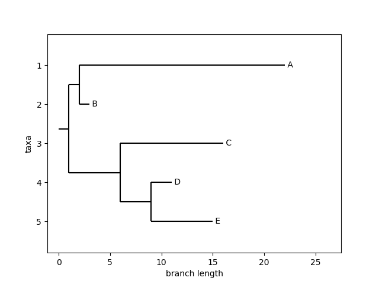

# Zadanie zaliczeniowe 1 | WBO
Nasze zadanie będzie polegało na symulacji i rekonstrukcji ewolucji sekwencji zgodnie z zadanym drzewem filogenetycznym.

Załóżmy, że mamy sekwencję kodującą ludzkie białko hydroksylazy fenyloalaniny (PAH.fa w załączniku). I wyobraźmy sobie, że w przyszłości wyewoluuje z niego (na drodze specjacji trwającej miliony lat) 5 różnych białek, A,B,C,D i E wg następującego schematu:

(Zakładamy, że nasza sekwencja kodująca białko PAH znajduje się w korzeniu tego drzewa, a długości krawędzi odpowiadają %mutacji punktowych).

Nasz program powinien:

1. Wczytać daną sekwencję białkową z pliku .fa i na jej podstawie wygenerować jedną z możliwych sekwencji DNA, które mogłyby ją kodować (można wylosować właściwy kodon dla każdego aminokwasu). (2 pkt)

2. Wczytać dane drzewo z pliku w formacie Newick (dla naszego drzewa jego opis w formacie newick wygląda tak jak w pliku "tree") (1 pkt)

3. Wygenerować losowo sekwencje A-E korzystając z modelu Markowa z czasem dyskretnym o założeniach podobnych do modelu Jukesa-Cantora (prawdopodobieństwo  mutacji w 1 kroku symulacji niech będzie 1/10000 na pozycję). Liczbę kroków algorytmu dobierz tak, aby oczekiwane  liczby mutacji były zgodne z zadanym drzewem( 2 pkt)

4. Przetłumacz wygenerowane sekwencje na białka i zapisz wygenerowane sekwencje w pliku fasta (bialka.fa) (1 pkt)

5. Stwórz na podstawie tych sekwencji białkowych i macierzy BLOSUM multiuliniowienie przy pomocy programu clustalw (2 pkt)

6. Na podstawie multiuliniowienia, wygeneruj drzewa filogenetyczne, przy pomocy metod upgma i nj (2 pkt).

Jako rozwiązanie prześlij plik w pythonie (.py, a nie .ipynb) z programem generującym wyniki, a także same pliki wynikowe (sekwencje, uliniowienia, drzewa)

Termin oddania jest za 3 tygodnie.

